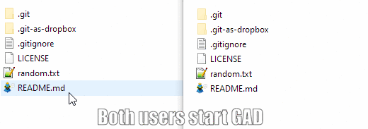
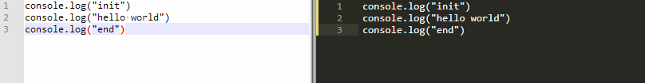

# git-as-dropbox (beta)

Convert any git repository into a cheap Dropbox-like folder. Let's say there are two users, A and B. If both run `git-as-dropbox ./my-repo` when user A adds, deletes or modifies a file, user B will receive these changes and vice versa.

GAD (short of **git-as-dropbox**) is not a Dropbox replacement but it is good enough to sync two folders across two computers. GAD leaves your original **local** repository completely untouched. This creates a copy of your _.git_ folder called _.git-as-dropbox_. All sync operations happen on this repository. All commits are then done in the new repository and sent **to the same remote repository** as the original one under the _git-as-dropbox_ branch.

## Installation

`npm install --global git-as-dropbox`

## Usage

 - Run `git-as-dropbox <repository-path>` on two different computers. When you first run GAD both repositories better be in sync to avoid initial git conflicts.
 - Any change will now be shared across both computers.

## Features

 - GAD respects your current git workflow. You can continue adding, committing and pushing to your original repository as you normally do.
 - If two users commit the same line at the same time GAD will just commit the conflict so that any user can resolve it.
 - Tested on Windows, Linux, Mac.

## Caveats

 - GAD creates a full copy of your current _.git_ folder. This means you will see a new _.git-as-dropbox_ folder in your project. This will make your current project twice as big in terms of disk usage. This should not be a problem unless you have an extremely very big repository.
 - GAD uses polling. It is the safest way to make it work across all OS.
 - This tool is not designed to work with several users at the same time over the same file. It is merely a quick and cheap way to share files through git in a similar fashion Dropbox does.

## Special cases

There are few special cases when several users edit at the same time. These are:

 - **When user A and user B edit the same line at the same time:** Dropbox would create two files, _file.txt_ and _file.txt (user's conflicted copy 00/00/0000)_. In GAD, both users will receive the conflict information as shown below.

This way any user can fix the conflict.
 - **When user A and B rename the same file at the same time:** Both users will receive both files.
 - **When multiple users edit the same file at the same time:** It will very likely create an unintelligible commit diff or it may just crash. GAD is not suitable for this scenario. If you want to allow multiple users editing take a look at my other project, [boy.dog](www.boy.dog), which uses Operational Transforms to sync multiple users in real time.

## Changelog

 - 1.0.8: Minor improvements.
 - 1.0.7: Fixed bug when _.gitignore_ was not currently present. If it is not found it will be created.
 - 1.0.6: Decreased polling time. Improved README. Minor fixes.

## FAQ

##### Does git-as-dropbox change my local repository?
No. Your local repository is left untouched. This means that your current local branch (of _.git_) will be "master".

##### Does git-as-dropbox change external repositories?
Yes. GAD creates the _git-as-dropbox_ branch in your remote repository. All changes are pushed to this branch and this is how files are sync'ed to other computers.

##### How do completely remove GAD from tracking a repository?
Stop GAD if currently running. Remove the _.git-as-dropbox_ hidden folder from your proyect. And delete the _git-as-dropbox_ branch from your external repository. GAD does not make changes to your original repository, however if you ever fetched all branches in a local repo you might want to delete these too.

##### GAD closes when I disconnect from my the server. Why?
This is normal. Any NodeJS app running on yor CLI will close as you disconnect from the server. To keep GAD running use `nohup` or `pm2` (recommended).

## License

GNU v3.0 © [@adelriosantiago](https://twitter.com/adelriosantiago)

